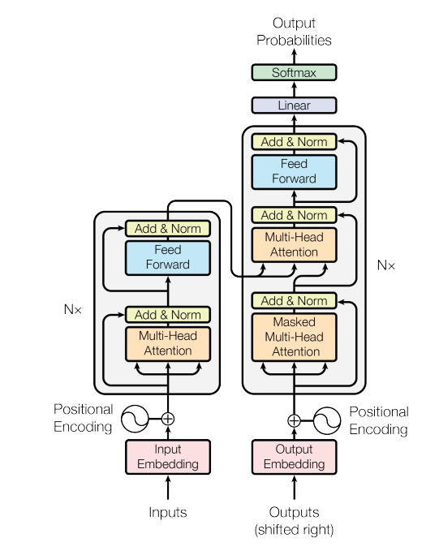
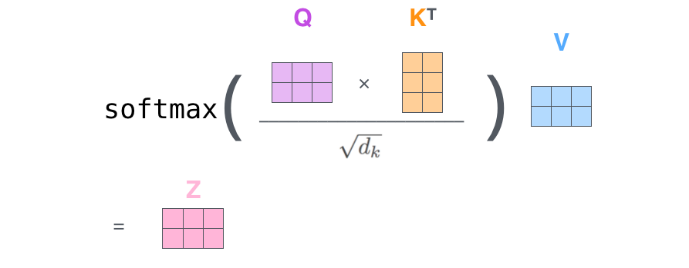
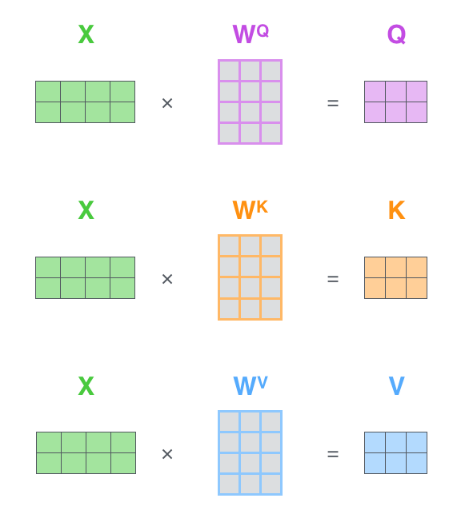
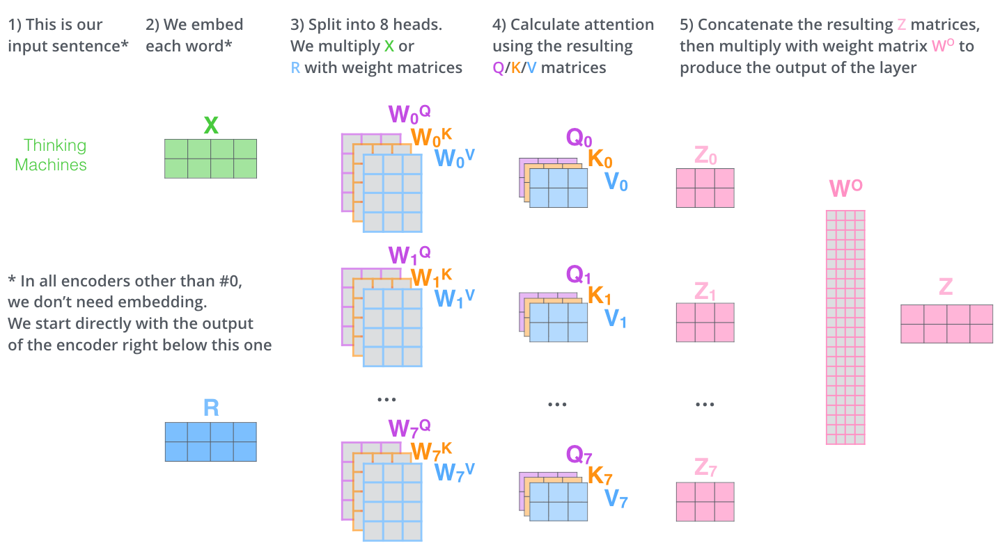

Transformer
===========

谷歌在文章《Attention is all you
need》中提出的transformer模型。如图主要架构：同样为encoder-decoder模式，左边部分是encoder，右边部分是decoder。

TensorFlow代码：*https://www.github.com/kyubyong/transformer*。

*预处理：*

用 sentencepiece 进行分词。

*Encoder 输入：*

初始输入为待翻译语句的embedding矩阵，由于句子长度不一致，需要做统一长度处理，长度取maxlength1，不够长的句子padding
0值，句尾加上\</s\>。

d = 512, [batchsize，maxlen1，d]

考虑到词语间的相对位置信息，还要加上语句的position
encoding，由函数形式直接求出。

>   PE(pos,2i) = sin(pos/10002i/d)

>   PE(pos,2i+1) = cos(pos/10002i/d)

Padding的值不做position encoding。[batchsize，maxlen1，d]

最终:

>   encoder input = position encoding + input embedding。

Encoder input : [batchsize，maxlen1，d]

*Encoder：*

Encoder 由N = 6个相同的layer连接组成。每个layer中有两个sublayer，分别是multihead
self-attention以及FFN。

>   Q = K = V = input

>   MultiHead(Q, K, V) = concat(head1, …, headh)Wo

>   headi = Attention(QW­iQ，KW­ik，VW­iV)

>   Attention(Q, K, V) = softmax(QKT/$$\sqrt{d}$$) V

(softmax前要做key_mask，把pad 0 的地方赋值为-inf，softmax后权重做query mask，
赋值0)

h = 8

W­iQ, W­ik, W­iV : [d, d/h]

Q : [maxlen_q, d]

K = V : [maxlen_k, d]

Maxlen_q = maxlen_k so: Q = K = V : [maxlen1, d]

QW­kQ，KW­ik，VW­iV : [maxlen1, d/h]

headi : [maxlen1, d/h] \* [d/h, maxlen1] \* [maxlen1, d/h] = [maxlen1, d/h]

Wo : [d, d]

MultiHead(Q,K,V): [maxlen, d]

(Softmax([maxlen_q, maxlen_k]) 在最后一个维度即maxlen_k 上做softmax。)

position-wise是因为处理的attention输出是某一个位置i的attention输出。

>   FFN(x) = ReLU ( xW1 + b1 ) \* W2 + b2

>   ReLU(x) = max( 0, x )

dff = 4 \* d = 2048

W1 : [d, dff]

W2 : [dff, d]

-   流程：

Input -\> dropout -\>

(

multihead self-attention -\> dropout -\> residual connection -\> LN -\>

FFN-\> dropout -\> residual connection -\> LN -\>

) \* 6

\-\> memory [batchsize，maxlen，d]

(代码中在multihead attention
中对score做dropout，FFN后没有dropout，但文章说每个sublayer的output都有一个dropout)

*Decoder 输入：*

*训练：*

目标句子首尾分别加上\<s\>,\</s\>。

Decoder input = Output embedding + position encoding

Decoder input : [batchsize，maxlen2，d]

*预测：*

初始向量为\<s\>对应embedding，之后将前一步的输出拼接到当前的所有预测构成当前的decoder输入。

*Decoder:*

Decoder由N = 6 个相同的layer组成，每个layer中有三个sublayer，分别是multihead
self-attention, mutihead attention以及FFN。

-   流程：

decoder input -\> dropout -\>

(

   Masked multihead self-attention(dec, dec, dec) = dec-\> dropout -\>

   multihead attention(dec, memory, memory) -\> dropout -\> residual connection

   -\> LN -\> FFN -\> dropout -\> residual connection -\> LN -\>

) \* 6

\-\> dec -\> linear -\> softmax

(Self-attention 的mask为一个和dec相同维度的上三角全为-inf的矩阵。)

Linear( x ) = xW

Dec : [batchsize，maxlen2，d]

W : [d, vocabsize]

W为词汇表embedding矩阵的转置, 输入输出的词汇表embedding矩阵为W。即三个参数共享。

Linear( x ) : [batchsize，maxlen2，vocabsize]

Softmax函数：

$p\left( k\|x \right)=\frac{\exp
({{z}_{k}})}{\sum\nolimits_{i=1}^{K}{\exp ({{z}_{i}})}}$

其中zi一般叫做 logits，即未被归一化的对数概率。

(代码中没有softmax层，和encoder同样FFN后没有dropout，但文章说每个sublayer的output都有一个dropout)

*损失函数：*

损失函数：cross entropy。用p代表predicted probability，用q代表groundtruth。即：

$cross\_entropy\_loss=\sum\limits_{k=1}^{K}{q\left(k\|x\right)\log (p\left( k\|x \right))}$

groundtruth为one-hot，即每个样本只有惟一的类别，$q(k)={{\delta
}_{k,y}}$，y是真实类别。

   ${{\delta }_{k,y}}\text{=}\left\{ \begin{matrix}
   1,k=y \\
   0,k\ne y \\
   \end{matrix} \right.$

对目标句子onehot 做label
smooth用$\tilde{q}(k\|x)$代替$q(k\|x)$。（为了正则化，防止过拟合）

   $\tilde{q}(k\|x)=(1-\varepsilon ){{\delta }_{k,y}}+\varepsilon u(k)$

可以理解为，对于$q(k)={{\delta
}_{k,y}}$函数分布的真实标签，将它变成以如下方式获得：首先从标注的真实标签的$\delta
$分布中取定，然后以一定的概率$\varepsilon
$，将其替换为在$u(k)$分布中的随机变量。$u(k)$为均匀分布，即$u(k)=1/K$。

*优化方法：*

Adam优化器：

学习率使用warm up learning rate:

learningrate = dmodel-0.5 \* min ( step_num-0.5, step_num \* warmup_steps-1.5 )

warmup_steps ：4000
